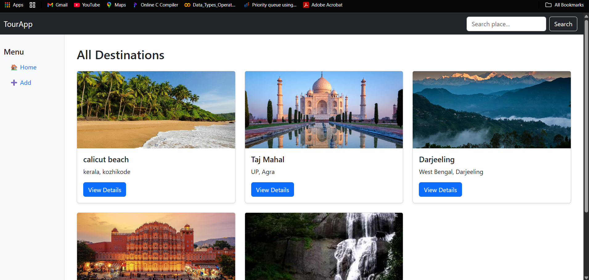
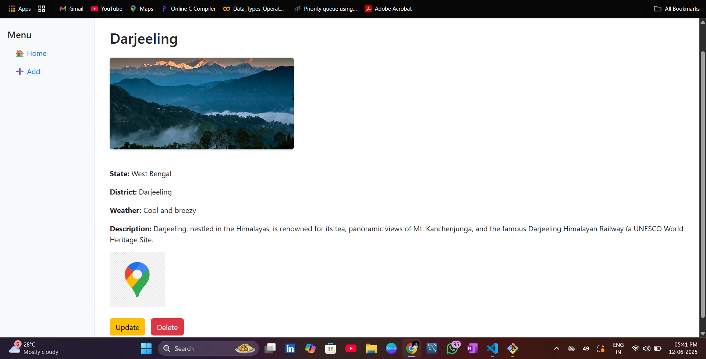

# tour_app
Made with Django Rest Frame Work
# 🗺️ TourProject — Explore Destinations with Ease!


TourProject is a user-friendly web application to add, view, and manage travel destinations using Django and MySQL. It allows you to showcase places with rich details and a map preview.

---

## 🚀 Features

- 🔍 Searchable destination listing
- ✍️ Add new places with descriptions and images
- 📍 Map integration using image links
- 🧾 Clean Bootstrap 5 UI with sidebar navigation
- 🗃️ MySQL DB with custom port support
- 🎨 Custom form design and user experience

---

## 📸 Screenshots

### Homepage


### Add Destination Page


---

## 🛠️ Tech Stack

- **Backend**: Django 3.2, Python 3.10
- **Frontend**: HTML, CSS, Bootstrap 5
- **Database**: MySQL (port 3309)
- **Others**: Django ORM, Virtualenv

---

## ⚙️ Setup Instructions

### Prerequisites

- Python 3.10+
- MySQL (running on port `3309`)
- Virtualenv

### 1. Clone the Repository

```bash
git clone https://github.com/yourusername/tourproject.git
cd tourproject
